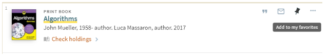
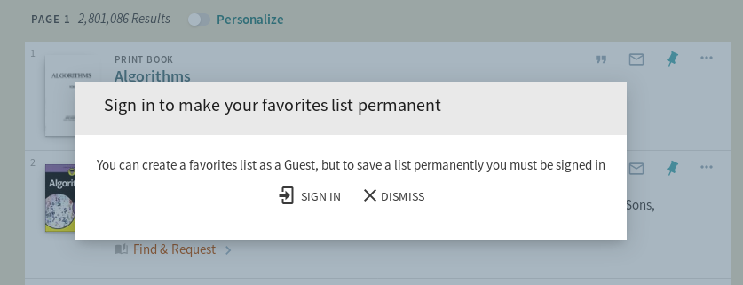

#
# Login Warning for Permanent Favorites List

Developer

Jeremiah Kellogg (Eastern Oregon University)

Code Repository

[https://github.com/alliance-pcsg/primo-explore-favorites-warning](https://github.com/alliance-pcsg/primo-explore-favorites-warning)

Description

Favorites lists can be created by guest users, but once they end their session that list goes away.  In order to make a favorites list permanent the user needs to login, however Primo has no built in warning to let guest users know this.  This development offers a pop-up up modal that warns users to log in to Primo to save their favorites list permanently.

The warning appears whenever a user clicks on a button with a pin icon and they aren't logged in.  This warning modal gives the option of logging in or dismissing the warning.  Dismissing the warning ensures the modal won't pop up again during the user's current session.





System Components

PBO, Package Manager

Skillset Requirements

PBO, JavaScript, CSS

Accessibility

Has not been tested for accessibility

Browser Support

Tested on Chrome, Firefox, Edge, and Safari

Mobile Support

Tested on iPhone

Implementation

**Steps**

1. In the PBO, make sure you have the &quot;Inherit Central Package&quot; box checked.
2. In your local package, in the custom.js file, include the module 'showFavoritesWarning' in your app definition. For example:

```js
var app = angular.module('viewCustom', ['showFavoritesWarning']);
```

If you are using other angular modules, include them in your app definition as well. For example:

```js
var app = angular.module('viewCustom', ['toggleInstitutions', 'showFavoritesWarning']);
```

3. Also in the custom.js file, add the following lines of code **within the anonymous function** (that is, before the closing brackets at the end of the file).

If your institution uses uses the [Badges Information Modal](https://github.com/alliance-pcsg/primo-explore-favorites-warning) in the Primo Toolkit you will need to hook into the same prmIconAfter compenent as that customization:

```js
app.component('prmIconAfter', {template:'<badges-modal></badges-modal><fav-overlay></fav-overlay>'});
```

If your institution does not implement the Badges Information Modal module you can omit it like so:
```js
app.component('prmIconAfter', {template:'<fav-overlay />'});
```

4. If you want to customize text associated with warning, add the following block of code within the anonymous function and edit the values.

```js
app.value('globalFavVars', {

        favWarnBarTxt:'Sign in to make your favorites list permanent',

        favWarnModalTitleText: 'Sign in to make your favorites list permanent',

        favWarnModalContentText:'You can create a favorites list as a Guest, but to save a list permanently you must be signed in';

});
```

5. In your local package, in the custom1.css file, add the following CSS if you want to customize colors, padding, or text styles:

```css

/* id for customizing the header box of the fav warning pop-up modal\*/

#fav-modal-header{

        /*background-color: tomato;*/

}

/* id for customizing text and font attributes in fav warning pop-up modal header*/

#fav-modal-header-text {

        /*padding-top: 10px;*/

}

/* id for customizing modal content box below modal header */

#fav-modal-content {

        /*background-color: tomato;*/

}

/* id for customizing modal content text below header*/

#fav-modal-content-text {

        /*font-size: 10px;*/

}
```
6. Zip and upload your package in the PBO.
7. Deploy your view.
