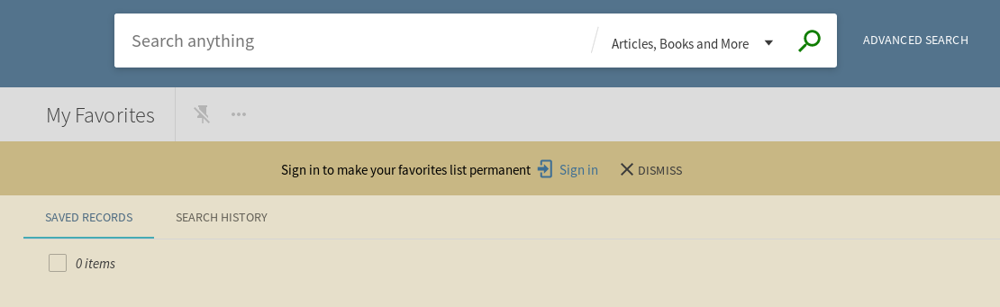

#
# Login Warning for Permanent Favorites List

Developer

Jeremiah Kellogg (Eastern Oregon University)

Code Repository

[https://github.com/alliance-pcsg/primo-explore-favorites-warning](https://github.com/alliance-pcsg/primo-explore-favorites-warning)

Description

Favorites lists can be created by guest users, but once they end their session that list goes away.  In order to make a favorites list permanent the user needs to login, but Primo has no built in warning to let guest users know this.  This development offers two warnings letting guest users know they need to login if they want to save a favorites list permanently.

The first is similar to the login for complete results warning bar that appears in search results list.  The favorites warning has the same functionality but appears on the My Favorites page when users aren't logged in:



The second warning is a button that appears over the add-to-favorites button when a user isn't logged in or if the warning has been dismissed.  When this overlay button is clicked a pop-up window appears to warn the user they must be logged in to save favorites lists permanently.  This window also gives the option of logging in or dismissing the warning:


System Components

PBO, Package Manager

Skillset Requirements

PBO, JavaScript, CSS

Accessibility

Has not been tested for accessibility

Browser Support

Tested on Chrome, Firefox, Edge, and Safari

Mobile Support

Tested on iPhone

Implementation

**Steps**

1. In the PBO, make sure you have the &quot;Inherit Central Package&quot; box checked.
2. In your local package, in the custom.js file, include the module 'showFavoritesWarning' in your app definition. For example:

```js
var app = angular.module('viewCustom', ['showFavoritesWarning']);
```

If you are using other angular modules, include them in your app definition as well. For example:

```js
var app = angular.module('viewCustom', ['toggleInstitutions', 'showFavoritesWarning']);
```

3. Also in the custom.js file, add the following lines of code **within the anonymous function** (that is, before the closing brackets at the end of the file).

For the warning bar that appears on the My Favorites page:

```js
app.component('prmFavoritesToolBarAfter', {template: <show-favorites-warning />' });
```

For the button overlay that calls the favorites warning modal window when clicked:

```js
app.component('prmSaveToFavoritesButtonAfter', {template:'<fav-overlay />'});
```

By adding those lines you are effectively enabling both warnings.  If you'd like to enable one and not the other, simply omit the one you don't want from the custom.js file.

4. If you want to customize text associated with warning or to disable a warning, add the following block of code within the anonymous function and edit the values.

```js
app.value('globalFavVars', {

        favWarnBarTxt:'Sign in to make your favorites list permanent',

        favWarnModalTitleText: 'Sign in to make your favorites list permanent',

        favWarnModalHoverText:'Add to my favorites';,

        favWarnModalContentText:'You can create a favorites list as a Guest, but to save a list permanently you must be signed in';,

});
```

5. In your local package, in the custom1.css file, add the following CSS if you want to customize colors, padding, or text styles:

```css
/\* id for customizing the alert bar on favorites page \*/

#fav-bar {

        /\*background-color: tomato;\*/

}

/\* id for customizing the text in the fav warning bar on favorites page\*/

#fav-bar-text {

}

/\* id for customizing the header box of the fav warning pop-up modal\*/

#fav-modal-header{

        /\*background-color: tomato;\*/

}

/\* id for customizing text and font attributes in fav warning pop-up modal header\*/

#fav-modal-header-text {

        /\*padding-top: 10px;\*/

}

/\* id for customizing modal content box below modal header \*/

#fav-modal-content {

        /\*background-color: tomato;\*/

}

/\* id for customizing modal content text below header\*/

#fav-modal-content-text {

        /\*font-size: 10px;\*/

}
```
6. Zip and upload your package in the PBO.
7. Deploy your view.
